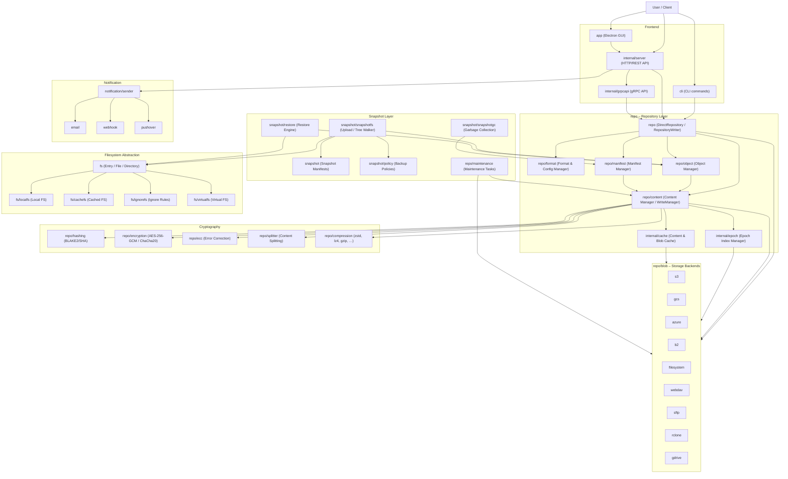
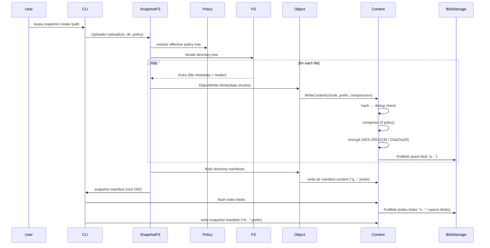
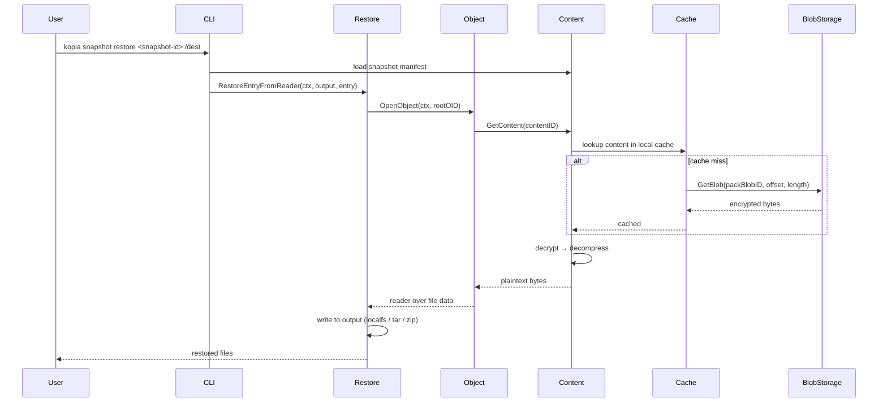
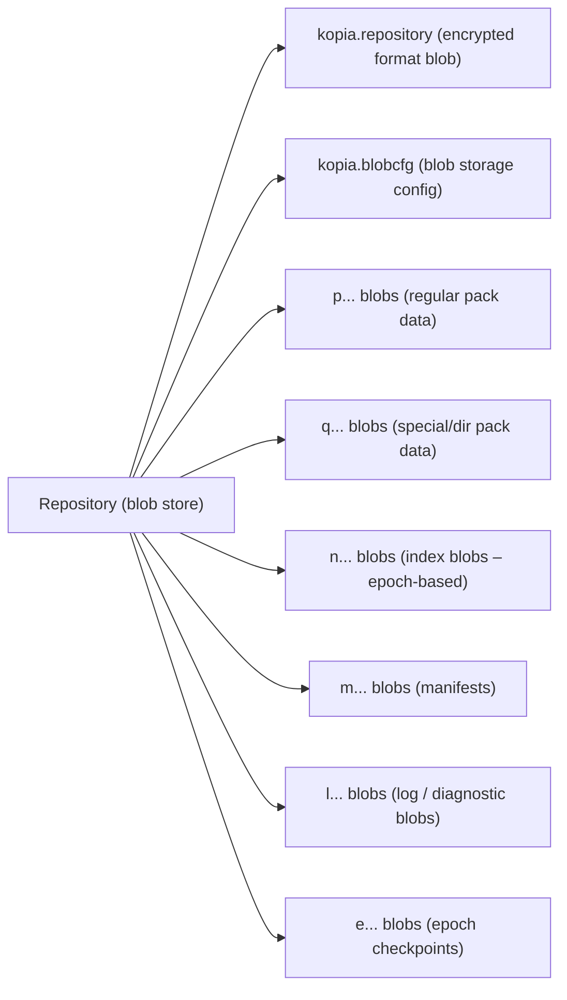
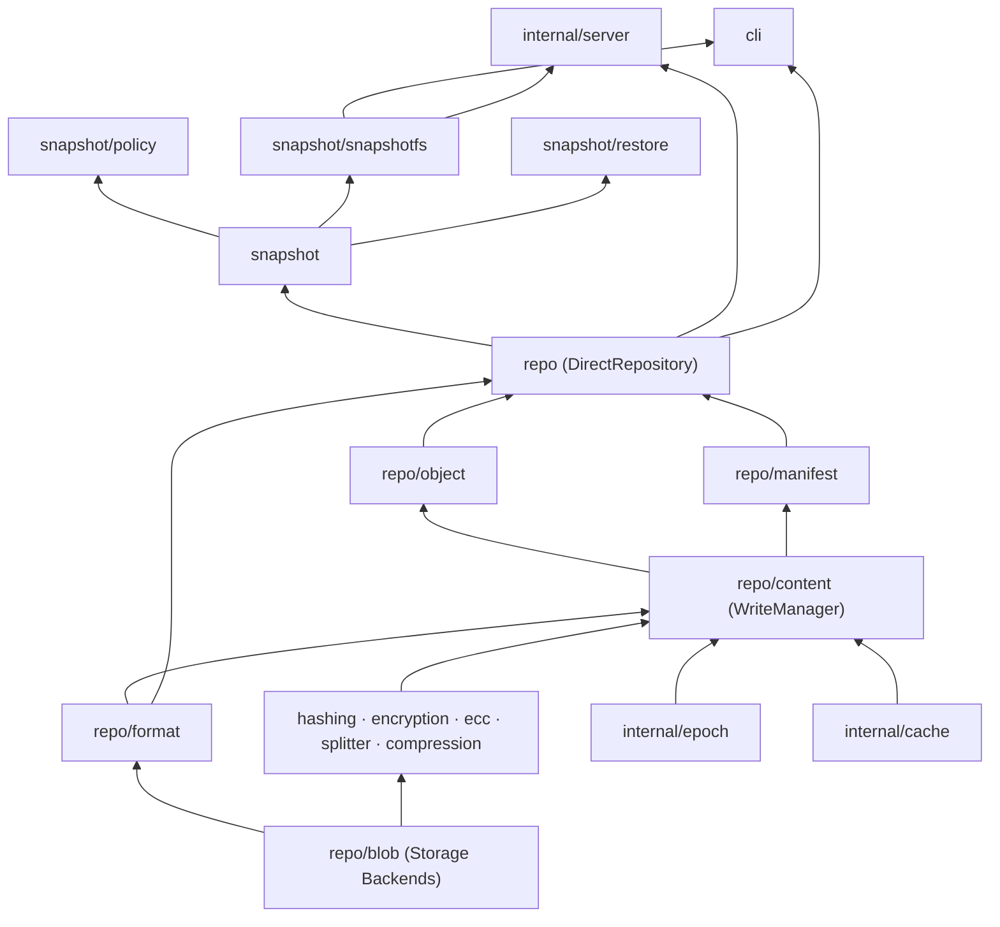

# Kopia Architecture Overview

Kopia is a fast, secure, open-source backup tool written in Go. It provides end-to-end encrypted, deduplicated, compressed snapshots of files and directories stored in a variety of cloud and local backends.

## High-Level Architecture

At the highest level, Kopia is structured around three major concerns:

1. **Frontend** – how users interact with Kopia (CLI, GUI, HTTP API, gRPC).
2. **Repository** – the core abstraction that orchestrates storage, content management, manifests, and format.
3. **Storage Backends** – the pluggable blob storage layer (S3, GCS, Azure, filesystem, …).

## Data Flow: Creating a Snapshot

When a user runs `kopia snapshot create`, the following pipeline executes:

## Data Flow: Restoring a Snapshot

## Repository Storage Layout

Kopia stores data in a flat blob namespace. Each blob has a well-known prefix that identifies its role:

## Layer Dependencies

## Key Design Principles

| Principle | Implementation |
|---|---|
| Content-addressable storage | Every chunk is identified by its cryptographic hash (BLAKE2B / SHA-256 / BLAKE3). Identical content is stored only once. |
| Zero-knowledge encryption | The repository password never leaves the client. Content is encrypted with AES-256-GCM or ChaCha20-Poly1305 using keys derived from the password via scrypt/pbkdf2. |
| Variable-length chunking | Files are split at content-defined boundaries (BuzHash32 / Rabin-Karp64 rolling hash or fixed sizes) enabling sub-file deduplication. |
| Pack blobs | Multiple small content chunks are packed together into a single blob to reduce API call overhead against cloud storage. |
| Epoch-based indexing | The index is maintained in epochs; clients write small per-write index blobs and the epoch manager compacts them asynchronously, enabling concurrent writers without locking. |
| Pluggable backends | The `repo/blob.Storage` interface is implemented independently for each cloud/local provider; the rest of the stack is backend-agnostic. |
| Policy inheritance | Snapshot policies inherit from parent paths and global defaults, resolved at upload time. |
