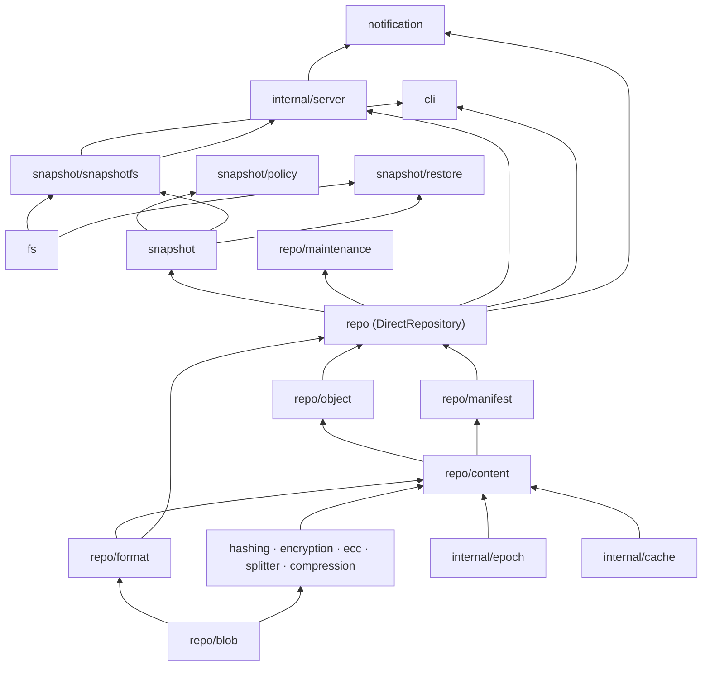

# Kopia Documentation

Kopia is a fast, secure, open-source backup tool. This documentation is generated from source code analysis of the [kopia/kopia](https://github.com/kopia/kopia) repository.

## Contents

### Architecture

- [Architecture Overview](architecture-overview.md) – High-level system design, data flows, and storage layout

### Core Repository Layer

- [repo/blob – Storage Backends](pkg-repo-blob.md) – Blob storage interface and all backend implementations
- [repo/content – Content Manager](pkg-repo-content.md) – Content-addressable storage, packing, indexing
- [repo/object – Object Manager](pkg-repo-object.md) – Large object splitting and assembly
- [repo/manifest – Manifest Manager](pkg-repo-manifest.md) – JSON metadata store
- [repo/format – Format & Configuration](pkg-repo-format.md) – Repository configuration, key derivation, format upgrades
- [repo/maintenance – Maintenance](pkg-repo-maintenance.md) – Scheduled GC, index compaction, blob cleanup

### Cryptography & Data Integrity

- [Cryptography Packages](pkg-crypto.md) – Hashing, encryption, compression, ECC, content splitting

### Snapshot Layer

- [snapshot & sub-packages](pkg-snapshot.md) – Snapshot manifests, policies, upload, restore, GC

### Filesystem Abstraction

- [fs & sub-packages](pkg-fs.md) – Filesystem interfaces, local FS, ignore rules, mount

### User Interfaces

- [cli – Command-Line Interface](pkg-cli.md) – All CLI commands and operating modes
- [internal/server – HTTP API Server](pkg-internal-server.md) – REST API, gRPC session, HTML UI, auth

### Internal Infrastructure

- [internal/epoch – Epoch Index Manager](pkg-internal-epoch.md) – Lock-free concurrent index management
- [internal/cache – Content Cache](pkg-internal-cache.md) – Local LRU cache for content and blobs
- [notification – Notification System](pkg-notification.md) – Email, webhook, Pushover notifications
- [Internal Support Packages](pkg-internal-misc.md) – gather, metrics, auth, ACL, scheduler, uitask, and more

## Quick Reference: Package Dependency Map

