# Package: `cli` – Command-Line Interface

## Purpose

`cli` implements all Kopia command-line commands using the [`kingpin`](https://github.com/alecthomas/kingpin) argument parsing library. It is the primary user interface for scripted or advanced use.

## Application Bootstrap

```go
// main.go
app := cli.NewApp()
kp := kingpin.New("kopia", "Kopia - Fast And Secure Open-Source Backup")
logfile.Attach(app, kp)
app.Attach(kp)
kingpin.MustParse(kp.Parse(os.Args[1:]))
```

`NewApp()` creates the `App` struct and registers all commands. `Attach(kp)` wires all commands to the kingpin application.

## `App` and `appServices`

`App` in `app.go` is the central coordinator. It implements `appServices`:

```go
type appServices interface {
    noRepositoryAction(act func(ctx) error) func(*ParseContext) error
    serverAction(sf *serverClientFlags, act func(ctx, *apiclient.KopiaAPIClient) error) func(*ParseContext) error
    directRepositoryWriteAction(act func(ctx, repo.DirectRepositoryWriter) error) func(*ParseContext) error
    directRepositoryReadAction(act func(ctx, repo.DirectRepository) error) func(*ParseContext) error
    repositoryReaderAction(act func(ctx, repo.Repository) error) func(*ParseContext) error
    repositoryWriterAction(act func(ctx, repo.RepositoryWriter) error) func(*ParseContext) error
    // ...
}
```

Action wrappers handle:
- Repository open/close lifecycle
- Logging setup
- Error handling and progress display
- Transparent server-mode vs direct-mode switching

## Command Groups

```mermaid
graph TD
    kopia["kopia"]

    kopia --> snapshot["snapshot (create, list, delete, restore, diff, expire, estimate, migrate, fix)"]
    kopia --> policy["policy (get, set, delete, list, import, export)"]
    kopia --> repo["repository (create, connect, disconnect, status, set-params, change-password, upgrade, sync, repair, validate-provider)"]
    kopia --> blob["blob (list, show, delete, stats, shards, gc)"]
    kopia --> content["content (list, show, delete, rewrite, stats)"]
    kopia --> manifest["manifest (list, show, delete)"]
    kopia --> cache["cache (info, clear, set, sync, prefetch)"]
    kopia --> server["server (start, status, stop, users, acl, refresh, pause, resume, upload, cancel, snapshot, throttle, estimate, list, logs)"]
    kopia --> benchmark["benchmark (hashing, encryption, ecc, compression, splitters, crypto)"]
    kopia --> mount["mount (snapshot, all)"]
    kopia --> diff["diff (two snapshots or directories)"]
    kopia --> logs["logs (list, show)"]
    kopia --> acl["acl (add, delete, list, enable)"]
    kopia --> user["users (add, delete, set-password, list, hashpassword)"]
    kopia --> maintenance["maintenance (run, set, info)"]
    kopia --> notification["notification (profile: add, delete, list, test)"]
```



## Two Operating Modes

### Direct Mode

The CLI opens the repository directly (accessing blob storage credentials locally):

```
kopia snapshot create /path
  → App.openRepository()
  → repo.Open(ctx, configFile, password, options)
  → DirectRepository
  → act(ctx, rep)
```

### Server / Proxy Mode

The CLI connects to a running Kopia server and proxies commands via the REST or gRPC API:

```
kopia --server-address=http://server:51515 snapshot create /path
  → apiclient.KopiaAPIClient
  → POST /api/v1/sources (trigger upload)
```

Flags like `--server-address`, `--server-username`, `--server-password`, `--server-cert-fingerprint` activate this mode.

## Progress Reporting (`cli_progress.go`)

`cliProgress` implements `snapshotfs.UploadProgress`:

- Prints real-time progress to stderr during uploads.
- Reports hashed / cached / uploaded bytes and file counts.
- Shows estimated completion time.

## Benchmark Commands

`command_benchmark_*.go` run isolated micro-benchmarks of individual subsystems (hashing, encryption, ECC, compression, splitters) and print throughput results. Used to compare algorithms for a given machine.

## Auto-Upgrade (`auto_upgrade.go`)

Checks whether the repository format needs upgrading and optionally triggers `kopia repository upgrade` automatically.

## Output Formatting

The `cli` package uses a `textOutput` helper that writes to `svc.stdout()` / `svc.stderr()`. Most commands support `--json` for machine-readable JSON output.
