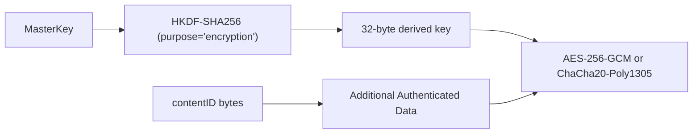
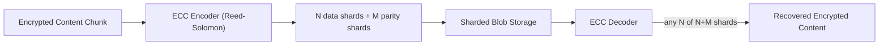

# Packages: Cryptography & Data Integrity

This document covers four closely related packages that together implement Kopia's zero-knowledge security model.

---

## `repo/hashing` – Content Hashing

### Purpose

Computes a **keyed hash** (HMAC or plain) of raw content bytes to produce a `contentID`. The hash function serves two goals:
1. Content-addressability / deduplication
2. Integrity verification (data tampering detection)

### Supported Algorithms

| Name | Hash | Notes |
|---|---|---|
| `BLAKE2B-256-128` | BLAKE2b-256, truncated to 128 bits | **default** |
| `BLAKE2B-256` | BLAKE2b-256 | full 256-bit |
| `BLAKE2S-128` | BLAKE2s-128 | 128-bit variant |
| `BLAKE3-256-128` | BLAKE3, truncated | fast |
| `BLAKE3-256` | BLAKE3 | full |
| `SHA256` | HMAC-SHA256 | |
| `SHA256-128` | HMAC-SHA256, truncated | |
| `SHA224` | HMAC-SHA224 | |

All algorithms use HMAC keyed with `HmacSecret` (derived from the master key), so an attacker who steals the content ID cannot reconstruct the data.

### Interface

```go
type HashFunc func(output []byte, data gather.Bytes) []byte
type HashFuncFactory func(p Parameters) (HashFunc, error)
```

`Parameters` must provide `GetHashFunction()` and `GetHmacSecret()`.

---

## `repo/encryption` – Content Encryption

### Purpose

Encrypts and authenticates individual content chunks before they are written to pack blobs. Encryption is performed using an AEAD cipher; the `contentID` bytes serve as additional authenticated data (AAD), binding the ciphertext to its identity.

### Supported Algorithms

| Name | Algorithm |
|---|---|
| `AES256-GCM-HMAC-SHA256` | AES-256-GCM with HMAC-SHA256 nonce derivation (default) |
| `CHACHA20-POLY1305-HMAC-SHA256` | ChaCha20-Poly1305 with HMAC-SHA256 nonce derivation |

### Key Derivation



The nonce is derived deterministically from the content ID via HMAC-SHA256 to avoid nonce reuse across re-encryptions of the same content.

### Interface

```go
type Encryptor interface {
    Encrypt(plainText gather.Bytes, contentID []byte, output *gather.WriteBuffer) error
    Decrypt(cipherText gather.Bytes, contentID []byte, output *gather.WriteBuffer) error
    Overhead() int
}
```

---

## `repo/compression` – Compression

### Purpose

Compresses content chunks before encryption, reducing storage size. Compression is optional and configured per-policy or per-object-writer call.

### Supported Algorithms

| Name | Library |
|---|---|
| `zstd-*` | `github.com/klauspost/compress/zstd` |
| `s2-*` | `github.com/klauspost/compress/s2` (Snappy variant) |
| `lz4` | `github.com/pierrec/lz4` |
| `gzip-*` | standard `compress/gzip` |
| `pgzip-*` | parallel gzip |
| `deflate-*` | `compress/flate` |

Each compressor is registered with a fixed 4-byte `HeaderID` embedded in the content blob so the correct decompressor is selected on read without consulting external metadata.

### Interface

```go
type Compressor interface {
    HeaderID() HeaderID
    Compress(output io.Writer, input io.Reader) error
    Decompress(output io.Writer, input io.Reader, withHeader bool) error
}
```

### Registration

```go
func RegisterCompressor(name Name, c Compressor)
func RegisterDeprecatedCompressor(name Name, c Compressor)
```

Deprecated compressors remain registered for read support but are excluded from new write operations.

---

## `repo/ecc` – Error Correction Codes

### Purpose

Provides **redundancy within sharded blob providers** (e.g. `blob/sharded`). ECC wraps the `encryption.Encryptor` interface and adds Reed-Solomon parity shards so that a subset of lost shards can be reconstructed.

### Supported Algorithms

| Name | Implementation |
|---|---|
| `RS-CRC-*` | Reed-Solomon with CRC integrity check (`ecc_rs_crc.go`) |

### Design

ECC is applied at the blob level (after encryption), not at the content level. This means ECC protects against storage-layer data loss (e.g. a subset of shards being deleted or corrupted), complementing the content-level encryption and hashing.



---

## `repo/splitter` – Content Splitter

### Purpose

Determines **where to split a byte stream** into content chunks. Two strategies are supported:

1. **Fixed-size** – split every N bytes (simple, predictable).
2. **Dynamic (rolling hash)** – split at content-defined boundaries using a rolling hash, enabling sub-file deduplication when data is inserted or deleted.

### Algorithms

| Name | Strategy | Sizes |
|---|---|---|
| `FIXED-128K` … `FIXED-8M` | Fixed | 128K–8M |
| `DYNAMIC-128K-BUZHASH` … `DYNAMIC-8M-BUZHASH` | BuzHash32 rolling hash | 128K–8M target |
| `DYNAMIC-128K-RABINKARP` … `DYNAMIC-8M-RABINKARP` | Rabin-Karp64 rolling hash | 128K–8M target |

### Interface

```go
type Splitter interface {
    NextSplitPoint(b []byte) int  // returns byte offset of next split, or -1
    MaxSegmentSize() int
    Reset()
    Close()
}
type Factory func() Splitter
```

Splitter instances are pooled (`splitter_pool.go`) to reduce allocation overhead during high-throughput uploads.

### Default

The repository default splitter is stored in `kopia.repository` (via `format.ObjectFormat.Splitter`) and used by object writers unless overridden in `WriterOptions`.
