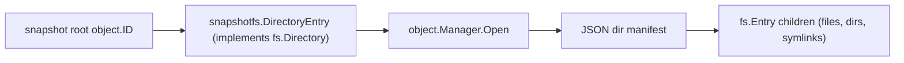

# Package: `fs` and Sub-packages – Filesystem Abstraction

## Purpose

The `fs` package defines a **unified filesystem interface** that decouples the rest of Kopia from any specific filesystem implementation. Both the local filesystem and the virtual repository filesystem implement the same interfaces, allowing the upload and restore engines to work generically.

---

## `fs` – Core Interfaces

### `Entry`

```go
type Entry interface {
    os.FileInfo            // Name, Size, Mode, ModTime, IsDir, Sys
    Owner() OwnerInfo      // UID, GID
    Device() DeviceInfo    // Dev, Rdev
    LocalFilesystemPath() string
    Close()
}
```

### Specializations

| Interface | Adds |
|---|---|
| `File` | `Open(ctx) (Reader, error)` |
| `Directory` | `Child(ctx, name) (Entry, error)`, `Iterate(ctx) (DirectoryIterator, error)`, `SupportsMultipleIterations() bool` |
| `Symlink` | `Readlink(ctx) (string, error)` |
| `StreamingFile` | `GetReader(ctx) (io.ReadCloser, error)` |
| `ErrorEntry` | `ErrorInfo() error` |

### `DirectoryIterator`

```go
type DirectoryIterator interface {
    Next(ctx context.Context) (Entry, error)
    Close()
}
```

`IterateEntries` is a helper that iterates all entries and invokes a callback.

---

## `fs/localfs` – Local Filesystem

Implements `fs.File`, `fs.Directory`, and `fs.Symlink` backed by the OS filesystem.

- Uses `os.Open` / `os.Readdir` for directory iteration.
- Preserves full `OwnerInfo` and `DeviceInfo` (platform-specific via build tags).
- `NewEntry(path)` returns the correct entry type based on `os.Lstat`.

---

## `fs/ignorefs` – Ignore Rules

Wraps a `Directory` and filters entries based on ignore rules derived from the snapshot `FilesPolicy`.

### Rule Sources

1. Embedded patterns from the `FilesPolicy` (`Ignore` list).
2. On-disk ignore files (`.kopiaignore`, `.gitignore` if configured) scanned per-directory.
3. `IgnoreCacheDirs` – automatically ignores directories containing a `CACHEDIR.TAG` file.
4. `MaxFileSize` – skips files exceeding the configured size.
5. `OneFileSystem` – skips entries on different device IDs.

Rules use glob matching (`internal/wcmatch`).

---

## `fs/cachefs` – Cached Filesystem

Wraps a `Directory` and caches directory listings. Used to avoid redundant `readdir` calls when the same directory is iterated multiple times (e.g. for hard-link detection).

---

## `fs/loggingfs` – Logging Filesystem

Wraps any `fs.Directory` and logs all entry accesses at a configurable verbosity level. Used for debugging and audit trails.

---

## `fs/virtualfs` – Virtual Filesystem

Provides in-memory `Directory` and `File` implementations for constructing filesystem trees programmatically. Used in tests and for building synthetic directory structures (e.g. the repository filesystem exposed to restore).

---

## Repository Filesystem (`snapshot/snapshotfs/repofs.go`)

`DirectoryEntry` implements `fs.Directory` over a snapshot directory object ID. Reading it fetches the directory manifest from the repository and returns child entries. This enables the restore engine and FUSE mount to navigate snapshots as if they were a live filesystem.



---

## `internal/mount` – Filesystem Mounting

Provides OS-level mounting of a snapshot as a read-only filesystem.

| File | Backend |
|---|---|
| `mount_fuse.go` | FUSE mount (Linux, macOS) via `internal/fusemount` |
| `mount_webdav.go` | WebDAV server via `internal/webdavmount` |
| `mount_net_use.go` | Windows `net use` mapping |

The mount manager tracks active mounts and handles clean unmounting on shutdown.
