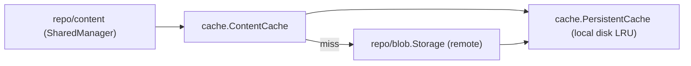

# Package: `internal/cache` – Content & Blob Cache

## Purpose

`internal/cache` provides a **persistent, local LRU cache** that stores decrypted (or encrypted) content/blob data on the local filesystem. It dramatically reduces round-trips to remote blob storage for repeated reads.

## Cache Types

### `ContentCache` (interface)

```go
type ContentCache interface {
    GetContent(ctx, contentID string, blobID blob.ID, offset, length int64, output *gather.WriteBuffer) error
    PrefetchBlob(ctx, blobID blob.ID) error
    CacheStorage() Storage
    Close(ctx)
}
```

Two implementations:

| Type | Behaviour |
|---|---|
| `contentCacheImpl` | Fetches individual content ranges (offset+length) from the pack blob on cache miss |
| `contentCachePassthrough` | No-op; used when caching is disabled |

### `PersistentCache`

The shared disk-backed LRU. Stores arbitrary byte blobs by a string key. On a miss it invokes a fetch callback, writes the result to disk, and returns it.

```go
type PersistentCache struct {
    // LRU eviction via last-access timestamps
    // per-key mutex (MutexMap) to prevent thundering herd on miss
}
```

### `MutexMap`

Provides per-key mutual exclusion to prevent multiple goroutines from simultaneously fetching the same cache key on a miss (thundering herd prevention).

## Cache Directory Layout

```
<baseCacheDirectory>/<cacheSubDir>/
    <shard0>/
        <cacheKey>     ← raw bytes (encrypted content or blob range)
    <shard1>/
        ...
```

Cache keys are **sharded** by shuffling the first byte to the end. This spreads content across 256 top-level directories, matching the blob storage sharding behavior and keeping directory sizes manageable.

## Cache Key Derivation

```go
func ContentIDCacheKey(contentID string) string {
    // move prefix character to end for even shard distribution
    if contentID[0] >= 'g' && contentID[0] <= 'z' {
        return contentID[1:] + contentID[0:1]
    }
    return contentID
}

func BlobIDCacheKey(id blob.ID) string {
    return string(id[1:] + id[0:1])
}
```

## Fetch Strategies

### Range Fetch (`fetchFullBlobs = false`)

On a content cache miss, only the specific byte range `[offset, offset+length)` within the pack blob is fetched from remote storage. This minimizes data transfer for random-access reads.

### Full Blob Fetch (`fetchFullBlobs = true`)

On a miss, the entire pack blob is downloaded and cached. Subsequent reads within the same pack blob are served from the local cache. This is more efficient for sequential access patterns (e.g. during restore of large snapshots).

## `Options`

```go
type Options struct {
    BaseCacheDirectory string
    CacheSubDir        string
    Storage            Storage        // override for testing
    HMACSecret         []byte         // integrity check on cached entries
    FetchFullBlobs     bool
    Sweep              SweepSettings
    TimeNow            func() time.Time
}
```

`HMACSecret` is used to compute an HMAC over cached entries, detecting corruption or tampering of the local cache.

## Cache Sweeping

`SweepSettings` controls LRU eviction:

```go
type SweepSettings struct {
    MaxSizeBytes       int64
    MinSweepAge        time.Duration
    SweepFrequency     time.Duration
}
```

A background goroutine periodically scans the cache directory, evicts least-recently-used entries until total size is below `MaxSizeBytes`, subject to `MinSweepAge`.

## Cache Metrics (`cache_metrics.go`)

All cache hits and misses are reported through `internal/metrics`:

| Metric | Type |
|---|---|
| `content_cache_hits` | Counter |
| `content_cache_misses` | Counter |
| `content_cache_fetch_errors` | Counter |
| `content_cache_store_errors` | Counter |
| `content_cache_fetch_duration` | Duration Distribution |

## Integration


