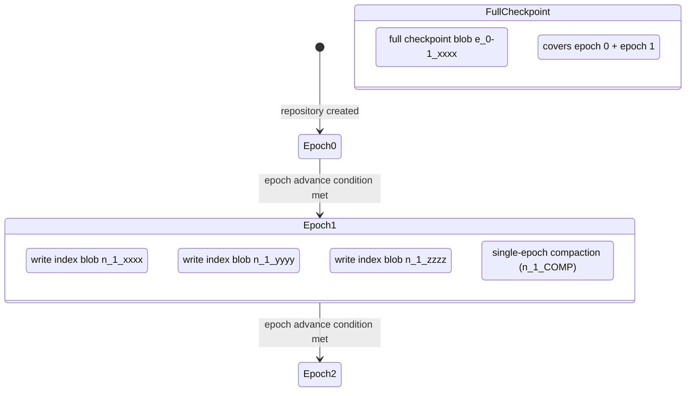
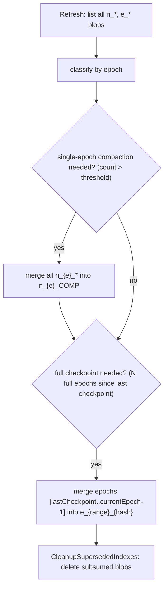

# Package: `internal/epoch` – Epoch Index Manager

## Purpose

The epoch manager implements **concurrent, lock-free index management** for Kopia repositories. It solves the problem of multiple clients writing to the same repository simultaneously without requiring distributed locking.

The design is documented in [GitHub issue #1090](https://github.com/kopia/kopia/issues/1090).

## Core Concept

Time is divided into **epochs** (configurable duration, default ~24 h). Within an epoch, each client write produces a small **per-write index blob** (prefix `n`). The epoch manager periodically compacts these into larger checkpoint blobs, and eventually into **full checkpoint** blobs (prefix `e`) that subsume all prior epochs.



## Epoch Advance Conditions

An epoch is advanced when **any** of the following conditions holds:

| Condition | Parameter | Default |
|---|---|---|
| Minimum age | `MinEpochDuration` | 24 h |
| Index blob count | `EpochAdvanceOnCountThreshold` | 20 blobs |
| Total index size | `EpochAdvanceOnTotalSizeBytesThreshold` | 100 MB |

## `Manager` Type

```go
type Manager struct {
    st             blob.Storage
    paramProvider  ParametersProvider
    // cached state protected by a mutex
    // background compaction goroutines
}
```

Key methods:

| Method | Description |
|---|---|
| `GetCompleteIndexSet(ctx, epoch)` | Returns the set of index blobs that together represent the complete index for a given epoch (or `LatestEpoch = -1`) |
| `WriteIndex(ctx, blobs)` | Writes new per-write index blobs for the current epoch |
| `Refresh(ctx)` | Re-reads blob listing and updates cached epoch state |
| `CleanupSupersededIndexes(ctx)` | Deletes old per-write blobs that have been subsumed by compactions |
| `Compact(ctx, opts)` | Performs single-epoch and/or full compaction |
| `AdvanceEpoch(ctx)` | Forces advance to the next epoch |

## Index Blob Naming Convention

```
n_{epoch}_{random16hex}      → per-write index blob (epoch N)
n_{epoch}_COMP               → single-epoch compaction result
e_{startEpoch}-{endEpoch}_{hash}  → full checkpoint (epoch range)
```

## Compaction Flow



## Parameters

```go
type Parameters struct {
    Enabled                               bool
    EpochRefreshFrequency                 time.Duration
    FullCheckpointFrequency               int
    CleanupSafetyMargin                   time.Duration
    MinEpochDuration                      time.Duration
    EpochAdvanceOnCountThreshold          int
    EpochAdvanceOnTotalSizeBytesThreshold int64
    DeleteParallelism                     int
}
```

Parameters are stored in the repository format and retrieved via `ParametersProvider`, allowing them to be updated without rewriting all data.

## Concurrency Safety

- Multiple readers refresh independently by listing blobs; the epoch number is determined by the blob listing, not by a shared counter.
- `ErrVerySlowIndexWrite` is returned if a write spans more than two epochs (e.g. after a laptop sleep of >48 h), preventing stale index writes.
- `CleanupSafetyMargin` prevents deletion of blobs that have just been compacted but may not yet be visible to all clients due to eventual consistency.
