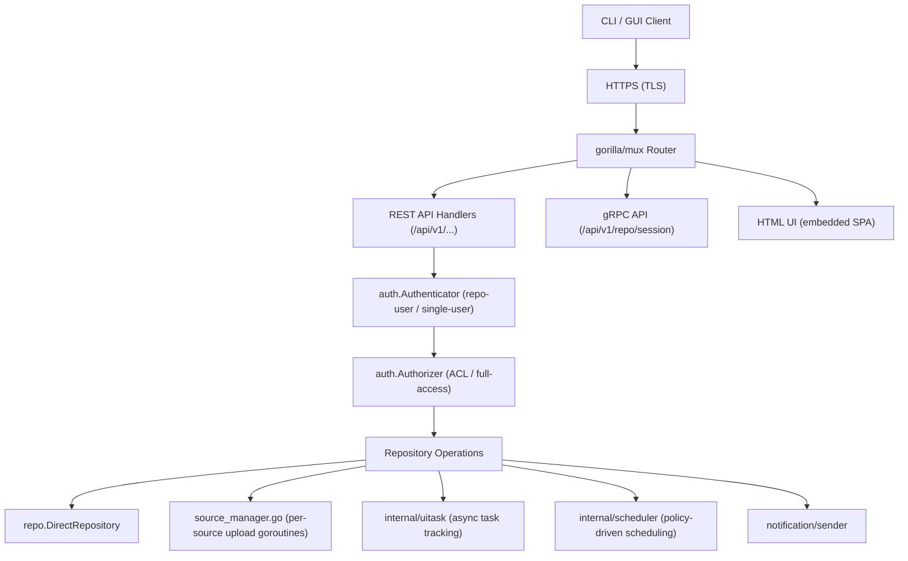
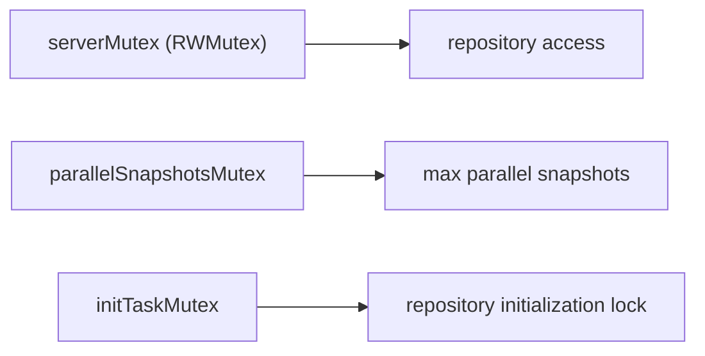

# Package: `internal/server` – HTTP API Server

## Purpose

`internal/server` implements the **Kopia Repository Server** (KRS): an HTTP/REST and gRPC server that allows remote clients to access a Kopia repository through a network connection rather than directly accessing blob storage.

Use cases:
- Central repository server shared by multiple machines.
- Separating storage credentials from backup clients.
- Providing a web UI (HTML UI) for graphical interaction.

## Server Architecture

## REST API Endpoints

Defined in `api_paths.go`:

| Path | Handler File | Description |
|---|---|---|
| `GET /api/v1/repo/status` | `api_repo.go` | Repository status |
| `POST /api/v1/repo/connect` | `api_repo.go` | Connect to existing repo |
| `POST /api/v1/repo/create` | `api_repo.go` | Create new repo |
| `POST /api/v1/repo/disconnect` | `api_repo.go` | Disconnect |
| `GET /api/v1/snapshots` | `api_snapshots.go` | List snapshots |
| `GET /api/v1/sources` | `api_sources.go` | List backup sources |
| `POST /api/v1/sources` | `api_sources.go` | Create/update source |
| `GET /api/v1/policies` | `api_policies.go` | List policies |
| `PUT /api/v1/policy` | `api_policies.go` | Set policy |
| `GET /api/v1/tasks` | `api_tasks.go` | List background tasks |
| `GET /api/v1/objects/{objectID}` | `api_object_get.go` | Stream object data |
| `POST /api/v1/restore` | `api_restore.go` | Trigger restore |
| `GET /api/v1/estimate` | `api_estimate.go` | Estimate snapshot size |
| `GET /api/v1/mounts` | `api_mount.go` | List mounts |
| `GET /api/v1/users` | `api_user.go` | List server users |
| `GET /api/v1/acl` | `api_cli.go` (CLI passthrough) | ACL management |

## gRPC Session (`grpc_session.go`)

The gRPC endpoint provides a **bidirectional streaming session** over the `RepositoryServer` protobuf service (defined in `internal/grpcapi/repository_server.proto`). The client sends requests and receives responses over a single HTTP/2 stream.

This is used by the CLI when connecting to a remote server (`kopia --server-address=... ...`), tunneling repository operations through the gRPC protocol.

## Authentication (`internal/auth`)

### Authenticators

| Implementation | Description |
|---|---|
| `authn_repo.go` | Validates username+password against repository user records stored in manifests |
| Single-user | Fixed credentials set at server startup |

### Authorizers

| Implementation | Description |
|---|---|
| `authz_acl.go` | ACL-based authorization using `internal/acl` rules |
| Full-access | All authenticated users get full access (used in single-user mode) |

### CSRF Protection

The server issues a short-lived JWT cookie (`Kopia-Auth`) after successful authentication. API calls that mutate state require this cookie plus a matching `X-Kopia-CSRF-Token` header.

## Source Manager (`source_manager.go`)

Each backup **source** (host+user+path) has a `sourceManager` goroutine that:
1. Monitors the scheduling policy.
2. Triggers snapshot uploads at scheduled times.
3. Reports upload progress through `UITask`.
4. Enforces the `maxParallelSnapshots` limit.

## UI Task Manager (`internal/uitask`)

Tracks **long-running asynchronous operations** (uploads, restores, maintenance) with:
- Progress reporting
- Cancellation support
- Log capture per task
- Persistence across page refreshes via the `/api/v1/tasks` endpoint

## HTML UI

`htmlui_embed.go` embeds the pre-built React single-page application into the binary. `htmlui_fallback.go` serves a basic fallback page when the UI is not embedded. The SPA communicates with the server via the REST API.

## Maintenance (`server_maintenance.go`)

The server runs a background maintenance goroutine that:
1. Loads the maintenance schedule from the repository.
2. Runs quick or full maintenance at the configured intervals.
3. Reports maintenance tasks through `UITask`.

## Concurrency

The server uses a read-write mutex to allow concurrent reads (most API calls) while serializing writes (repository connect/disconnect).
