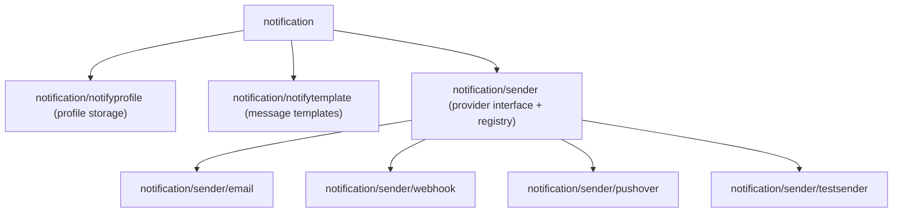
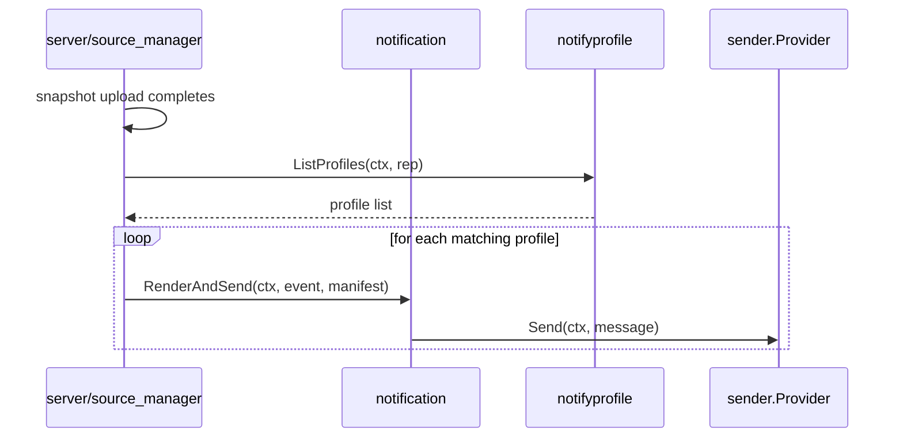

# Package: `notification` – Notification System

## Purpose

The `notification` package provides a pluggable system for sending notifications after snapshot events (success, failure, start). Notification profiles are stored in the repository and associated with sources via policy.

## Package Structure



---

## `notification/sender` – Provider Interface

### `Provider`

```go
type Provider interface {
    Send(ctx context.Context, msg *Message) error
    Format() string   // "html" or "md"
    Summary() string
}
```

### `Message`

```go
type Message struct {
    Subject     string
    BodyHTML    string
    BodyMD      string
}
```

### Registration

Each provider self-registers with `Register[T](method, factory)`. The generic factory marshals/unmarshals the provider-specific options from JSON, enabling storage of provider config in repository manifests.

```go
func Register[T any](method Method, p Factory[*T])
func GetSender(ctx, profile, method, jsonOptions) (Sender, error)
```

### Implementations

| Provider | Transport | Config |
|---|---|---|
| `email` | SMTP | host, port, username, password, from, to |
| `webhook` | HTTP POST (JSON/form) | URL, method, headers, body template |
| `pushover` | Pushover API | API token, user key |
| `testsender` | In-memory (testing) | none |

---

## `notification/notifyprofile` – Profile Storage

Notification profiles are persisted in the repository as manifests with `type=notificationProfile`. Each profile links a name, a provider `Method`, and JSON options.

Functions:
- `SaveProfile(ctx, rep, profile)` – writes profile manifest
- `GetProfile(ctx, rep, name)` – loads profile by name
- `ListProfiles(ctx, rep)` – lists all profiles
- `DeleteProfile(ctx, rep, name)` – removes a profile

---

## `notification/notifytemplate` – Message Templates

Provides Go `text/template` / `html/template` rendering of notification messages. Templates receive a `TemplateData` struct containing:

- Snapshot manifest (source, stats, timing)
- Error information (if failed)
- Policy information

Templates are embedded in the binary with sensible defaults for each event type (snapshot start, success, failure).

---

## Integration with Server and CLI



CLI commands (`kopia notification profile add/delete/list/test`) manage profiles. `kopia notification profile test` sends a test message through a configured profile.
