# Package: `repo/blob` – Blob Storage Abstraction

## Purpose

`repo/blob` defines the **core storage interface** that all backend providers must implement. It is the lowest layer of Kopia's stack: everything above it is backend-agnostic.

## Key Interfaces

### `Storage`

```go
type Storage interface {
    Volume
    Reader
    PutBlob(ctx, blobID ID, data Bytes, opts PutOptions) error
    DeleteBlob(ctx, blobID ID) error
    Close(ctx) error
    FlushCaches(ctx) error
    ExtendBlobRetention(ctx, blobID ID, opts ExtendOptions) error
    IsReadOnly() bool
}
```

`Storage` composes `Volume` (capacity query) and `Reader` (get / list / metadata), then adds mutation operations.

### `Reader`

```go
type Reader interface {
    GetBlob(ctx, blobID ID, offset, length int64, output OutputBuffer) error
    GetMetadata(ctx, blobID ID) (Metadata, error)
    ListBlobs(ctx, blobIDPrefix ID, cb func(Metadata) error) error
    ConnectionInfo() ConnectionInfo
    DisplayName() string
}
```

### `Bytes` / `OutputBuffer`

`Bytes` is an abstraction over non-contiguous byte buffers (backed by `internal/gather`). `OutputBuffer` is implemented by `gather.WriteBuffer` and used for zero-copy reads.

## Blob Metadata

```go
type Metadata struct {
    BlobID    ID
    Length    int64
    Timestamp time.Time
}
```

Each blob has a string `ID`, a byte length, and a server-assigned modification timestamp.

## Object Retention / Locking

```go
type PutOptions struct {
    RetentionMode   RetentionMode   // GOVERNANCE | COMPLIANCE | Locked (Azure)
    RetentionPeriod time.Duration
    DoNotRecreate   bool
    SetModTime      time.Time
    GetModTime      *time.Time
}
```

Retention options are forwarded to providers that support object-lock (S3, Azure immutable blobs).

## Utility Functions

| Function | Description |
|---|---|
| `ListAllBlobs` | Collects all blobs with a given prefix into a slice |
| `IterateAllPrefixesInParallel` | Iterates multiple prefixes concurrently using a semaphore |
| `DeleteMultiple` | Deletes a list of blobs in parallel |
| `PutBlobAndGetMetadata` | PutBlob + returns resulting Metadata |
| `ReadBlobMap` | Reads all blobs into a `map[ID]Metadata` |
| `EnsureLengthExactly` | Validates partial read length |

## Backends

```mermaid
graph TD
    Storage["blob.Storage interface"]
    Storage --> S3["s3 (Amazon S3 + compatible)"]
    Storage --> GCS["gcs (Google Cloud Storage)"]
    Storage --> Azure["azure (Azure Blob Storage)"]
    Storage --> B2["b2 (Backblaze B2)"]
    Storage --> Filesystem["filesystem (local / NFS)"]
    Storage --> WebDAV["webdav (WebDAV server)"]
    Storage --> SFTP["sftp (SSH/SFTP server)"]
    Storage --> Rclone["rclone (via rclone subprocess)"]
    Storage --> GDrive["gdrive (Google Drive)"]

    subgraph Wrappers
        Storage --> Readonly["readonly (read-only wrapper)"]
        Storage --> Retrying["retrying (retry on transient errors)"]
        Storage --> Throttling["throttling (rate limiting)"]
        Storage --> Logging["logging (log all calls)"]
        Storage --> BeforeOp["beforeop (pre-op hooks)"]
        Storage --> Sharded["sharded (prefix sharding)"]
        Storage --> StorageMetrics["storagemetrics (metrics collection)"]
    end
```



`DefaultProviderImplementation` is an embeddable struct that provides sensible no-op defaults for `Close`, `FlushCaches`, `GetCapacity`, `ExtendBlobRetention`, and `IsReadOnly`, reducing boilerplate in each provider.

## Registry

`registry.go` maintains a map of registered storage factories keyed by `ConnectionInfo.Type`, allowing providers to self-register and be constructed from a JSON `ConnectionInfo`.
