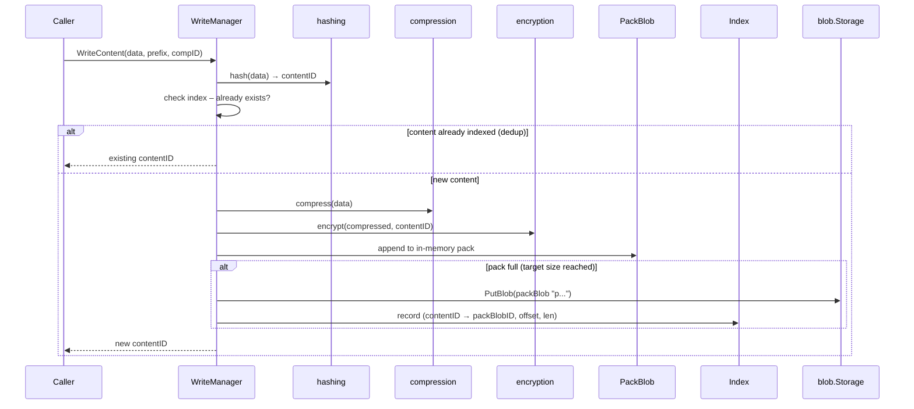
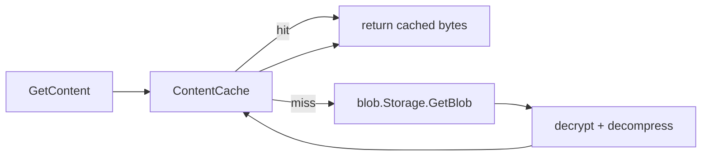

# Package: `repo/content` – Content Manager

## Purpose

`repo/content` implements **content-addressable storage** on top of the blob layer. It handles:

- Content hashing and deduplication
- Compression and encryption of content chunks
- Packing many small chunks into large pack blobs
- Index management (which content is in which pack blob at what offset)
- Read-through content cache

## Core Types

### `WriteManager`

```go
type WriteManager struct {
    revision atomic.Int64
    mu       sync.RWMutex
    // session tracking, flush state, pending pack blobs, index writers ...
}
```

`WriteManager` is the write-capable content manager. It wraps a `SharedManager` and adds write-side state: pending content chunks, pack builders, and session tracking.

### `SharedManager`

The read-capable base, shared between sessions. It owns the content index, the cache, and coordinates with the epoch manager for index reads.

### `ReadManager` (alias: `committed_read_manager.go`)

Exposes read-only operations: `GetContent`, `ContentInfo`, `IterateContents`.

## Content Lifecycle



## Pack Blob Prefixes

| Prefix | Meaning |
|---|---|
| `p` | Regular pack blob containing file data |
| `q` | Special pack blob (directory manifests, internal) |

Pack blobs are named with a 16-byte random hex suffix (e.g. `p3a7f...`).

## Index Architecture

Content location is tracked in **index blobs**. Each index entry maps:

```
contentID → (packBlobID, offset, length, flags, timestamp)
```

The index is split into two sub-packages:

### `content/index`

Low-level index entry encoding/decoding. Supports v1 and v2 index formats.

### `content/indexblob`

Manages the set of index blobs in storage: writing new index blobs, listing, compacting. Works with the epoch manager to determine which index blobs form the complete current index.

## Epoch-Based Index Management

See [`internal/epoch`](pkg-internal-epoch.md) for full details. In summary: every `WriteContent` + `Flush` produces a new small index blob. The epoch manager compacts them over time without requiring distributed locking.

## Content Cache

`internal/cache` provides a persistent LRU cache on the local filesystem.



Cache entries are stored by `contentID` (with prefix shuffled for even shard distribution). Blob caching (`fetchFullBlobs=true`) downloads the entire pack blob on first miss, improving locality for sequential reads.

## Key Constants

| Constant | Value | Purpose |
|---|---|---|
| `PackBlobIDPrefixRegular` | `"p"` | prefix for regular pack blobs |
| `PackBlobIDPrefixSpecial` | `"q"` | prefix for special pack blobs |
| `DefaultIndexVersion` | `2` | default index format version |
| `parallelFetches` | `5` | concurrent goroutines for parallel blob reads |
| `flushPackIndexTimeout` | `10 min` | maximum time before pending index is flushed |

## Sessions

A `SessionInfo` is written when a `WriteManager` session opens and deleted on clean close. Stale sessions (from crashed clients) are detected during maintenance and their incomplete pack blobs are cleaned up.

## Maintenance Hooks

`content_manager.go` exposes:
- `Flush` – flushes pending pack blobs and index
- `CompactIndexes` – triggers index compaction
- `RewriteContent` – re-encrypts/re-compresses content (used during format upgrade)
- `IterateContents` – scans all indexed content entries
