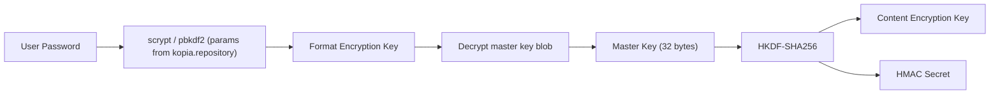
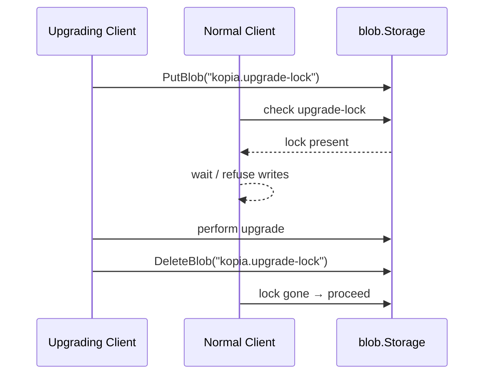

# Package: `repo/format` – Format & Configuration Manager

## Purpose

`repo/format` manages the **repository configuration** stored in two special blobs:

| Blob | Purpose |
|---|---|
| `kopia.repository` | Encrypted repository parameters (hash, encryption, splitter, master key derivation) |
| `kopia.blobcfg` | Blob storage configuration (retention policy, read-only flag) |

These blobs are the root of trust for the entire repository. They are re-read and validated on each repository open.

## Key Types

### `Manager`

```go
type Manager struct {
    blobs         blob.Storage
    validDuration time.Duration
    password      string
    cache         blobCache
    immutable     Provider
    // mu-protected mutable state ...
}
```

`Manager` caches the decrypted configuration for `validDuration` and re-fetches it on expiry. This ensures that configuration changes (e.g. password rotation) are picked up across long-running sessions.

### `Provider` (interface)

Exposes immutable repository parameters after decryption:

```go
type Provider interface {
    HashFunction() string
    HmacSecret() []byte
    Encryption() EncryptionAlgorithm
    MasterKey() []byte
    Splitter() string
    MaxPackSize() int
    // ... epoch parameters, ECC parameters, ...
}
```

### `KopiaRepositoryJSON`

The on-disk JSON format of `kopia.repository`. Contains:
- Repository unique ID (32-byte random)
- Format version
- Key derivation parameters (scrypt / pbkdf2)
- Encrypted master key blob
- Hash / encryption / splitter algorithm names

### `RepositoryConfig`

Extended in-memory configuration derived from the JSON format, including resolved `ObjectFormat` and epoch parameters.

### `ObjectFormat`

```go
type ObjectFormat struct {
    Splitter string
}
```

Passed directly to `repo/object.Manager` to select the default splitting strategy.

## Key Derivation



The **master key** never changes; only the wrapper encryption (which protects it in `kopia.repository`) changes when the password is rotated. This means password changes only require rewriting the format blob, not re-encrypting all content.

## Format Cache (`format_blob_cache.go`)

The format blob is cached locally to reduce round-trips to blob storage on every repository open. The cache respects `validDuration`; after expiry the blob is re-fetched and re-decrypted.

## Upgrade Locking (`upgrade_lock.go`)

When a repository format upgrade is in progress (e.g. migrating from v1 to v2 index), an **upgrade lock** blob is written. Other clients detect the lock and refuse to write until the upgrade completes or the lock expires.



## Password Change

`format_change_password.go` implements the password rotation flow:
1. Decrypt master key with old password.
2. Re-derive format encryption key from new password.
3. Re-encrypt master key under new format encryption key.
4. Overwrite `kopia.repository` blob.

Content blobs are unaffected.
