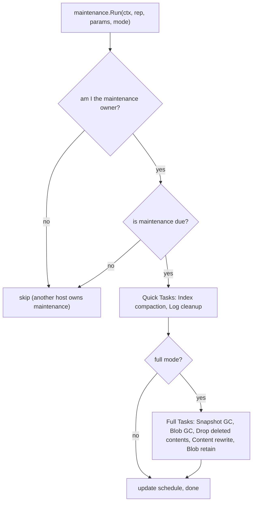
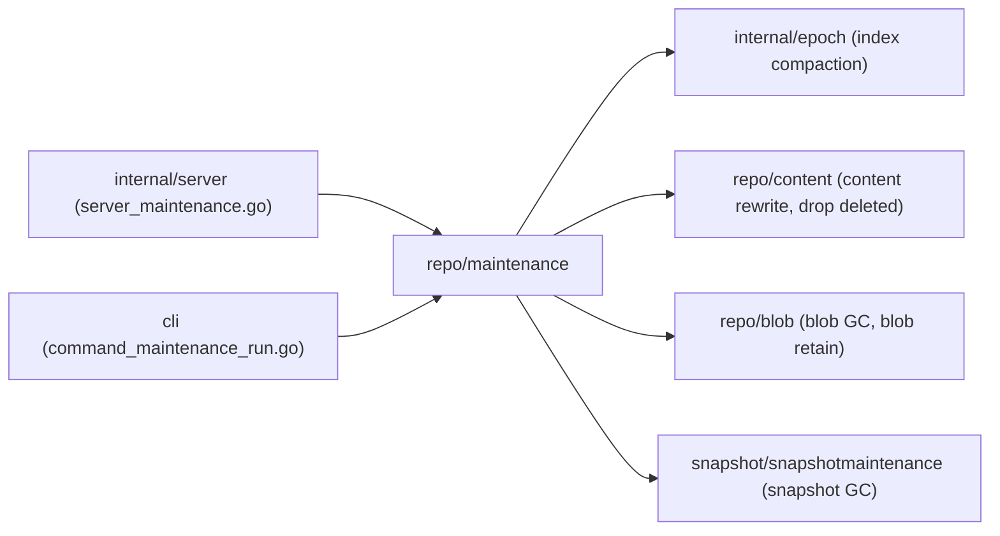

# Package: `repo/maintenance` – Repository Maintenance

## Purpose

`repo/maintenance` implements **scheduled background maintenance tasks** that keep the repository healthy and prevent unbounded growth of metadata and unreferenced data.

## Maintenance Modes

| Mode | Frequency (default) | Tasks |
|---|---|---|
| **Quick** | Every 1 hour | Index compaction (single-epoch), log cleanup |
| **Full** | Every 24 hours | All quick tasks + blob GC, drop deleted contents, content rewrite (if needed) |

## Maintenance Schedule (`maintenance_schedule.go`)

The schedule is stored as a manifest (`type=maintenance`) in the repository. It tracks:

- Last quick and full maintenance run times.
- Configured frequencies.
- Whether maintenance is paused.
- The **maintenance owner** (hostname+username) – only the owner runs maintenance to prevent concurrent runs.

```go
type Schedule struct {
    NextMaintenanceTime time.Time
    Owner               OwnerInfo
    Runs                []RunInfo
}
```

## Maintenance Tasks

### Index Compaction (`index_compaction.go`)

Compacts small per-write index blobs into fewer, larger ones, reducing `ListBlobs` API call overhead. Delegates to `internal/epoch.Manager.Compact`.

### Blob GC (`blob_gc.go`)

Identifies **pack blobs** that contain no live content (all content IDs have been deleted) and deletes them. Also cleans up orphaned index blobs.

### Drop Deleted Contents (`drop_deleted_contents.go`)

After content has been marked as deleted in the index for longer than the safety margin, removes those index entries entirely to reduce index size.

### Content Rewrite (`content_rewrite.go`)

Re-encrypts and re-compresses content blobs. Used when:
- Changing encryption algorithm (format upgrade).
- Re-packing fragmented pack blobs.
- Applying new compression settings.

### Log Cleanup (`cleanup_logs.go`)

Deletes old diagnostic log blobs (prefix `l`) beyond the configured retention period.

### Blob Retain (`blob_retain.go`)

Extends object-lock retention periods on blobs that must be retained (when S3 Object Lock or Azure Immutable Blobs are configured).

## Maintenance Run Flow



## Safety Mechanisms (`maintenance_safety.go`)

- **Safety margin**: Deleted blobs are not immediately removed; they are held for a configurable period (default 4 h) to account for clock skew and in-progress writes.
- **Owner lock**: Only one host runs full maintenance at a time, preventing races.
- **Dry-run mode**: All GC operations support a `DryRun` flag that logs what would be deleted without actually deleting.

## Parameters (`maintenance_params.go`)

```go
type Params struct {
    Owner         OwnerInfo
    QuickCycle    CycleParams
    FullCycle      CycleParams
    LogRetention  LogRetentionOptions
}

type CycleParams struct {
    Enabled       bool
    Interval      time.Duration
}
```

Parameters are stored in the repository manifest and can be updated with `kopia maintenance set`.

## Integration


