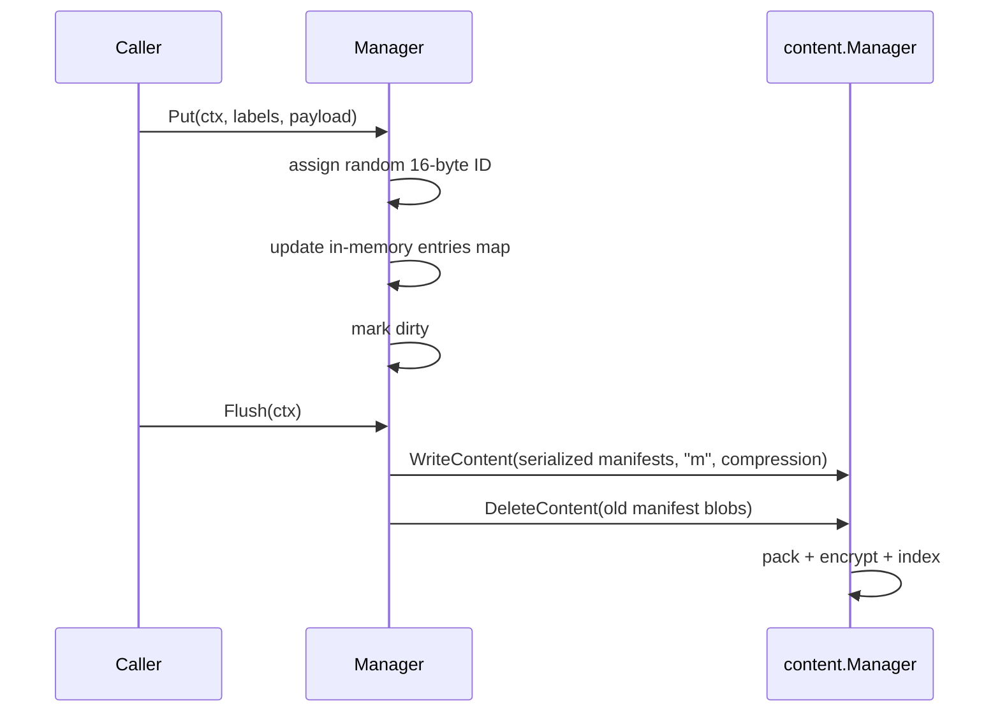
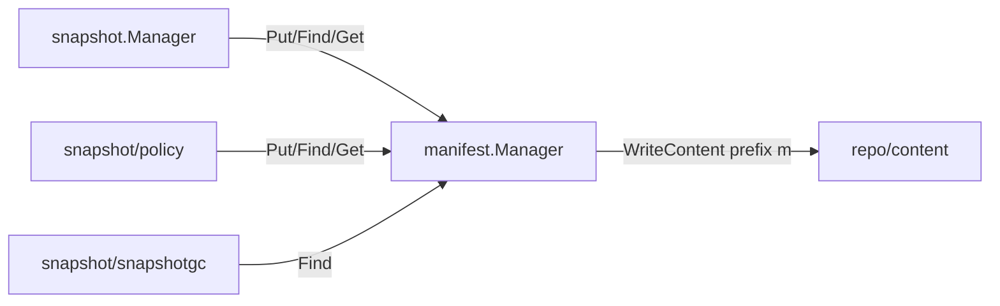

# Package: `repo/manifest` – Manifest Manager

## Purpose

`repo/manifest` provides a **JSON metadata store** inside the repository. Manifests are arbitrary JSON documents identified by a unique `ID` and tagged with key-value labels. They are used by higher-level packages (snapshot, policy, maintenance schedule) to persist structured metadata.

## Storage

Manifests are stored as content with the prefix `"m"`. Each manifest is a JSON blob written through the content manager, so it benefits from encryption and compression automatically.

### Auto-compaction

When the number of individual manifest content blobs exceeds `autoCompactionContentCountDefault` (16), the manager automatically compacts them into a single merged content blob to reduce index bloat.

## Core Types

### `Manager`

```go
type Manager struct {
    mu sync.Mutex
    b  contentManager
    // in-memory manifest cache and dirty flags
}
```

The manager keeps an **in-memory cache** of all manifests. It loads all `"m"` contents on first access (`loadCommittedContentsLocked`) and updates the cache on every put/delete.

### `EntryMetadata`

```go
type EntryMetadata struct {
    ID      ID                `json:"id"`
    ModTime time.Time         `json:"modified"`
    Labels  map[string]string `json:"labels"`
    Length  int               `json:"length"`
}
```

### `ID`

A 16-byte hex string uniquely identifying each manifest entry.

## Operations

| Method | Description |
|---|---|
| `Put(ctx, labels, payload)` | Write or update a manifest entry |
| `Get(ctx, id, data)` | Read and JSON-unmarshal a manifest entry |
| `Delete(ctx, id)` | Soft-delete a manifest entry |
| `Find(ctx, labels)` | Search for entries matching a label subset |
| `Flush(ctx)` | Persist in-memory changes to content storage |

### Label-Based Lookup

`Find` performs an in-memory scan of all manifest metadata. Labels must be an exact subset match. This is used extensively by the snapshot layer:

```go
rep.FindManifests(ctx, map[string]string{
    "type":     "snapshot",
    "hostname": "myhost",
})
```

## Manifest Lifecycle



## Integration with Snapshot

The snapshot package stores snapshot manifests using `TypeLabelKey = "type"` → `"snapshot"`, plus `"username"`, `"hostname"`, `"path"` labels. This allows efficient filtering by source without scanning all manifest payloads.


