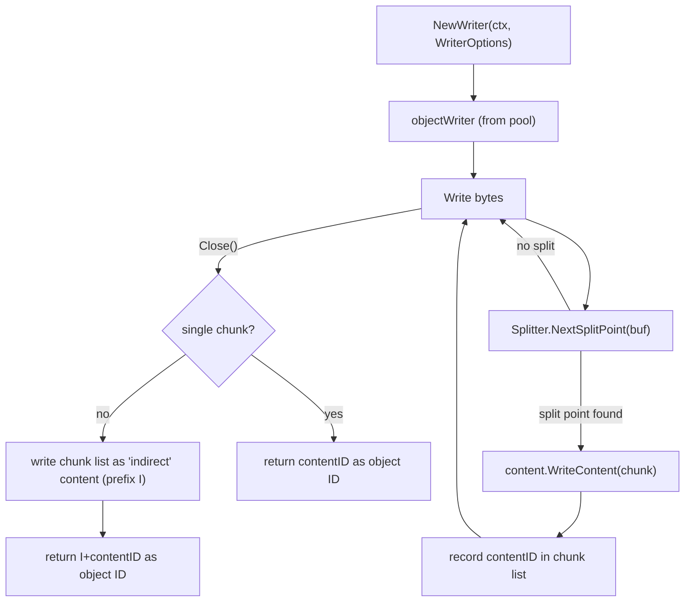
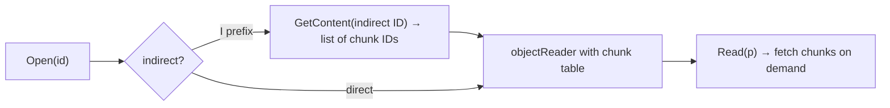
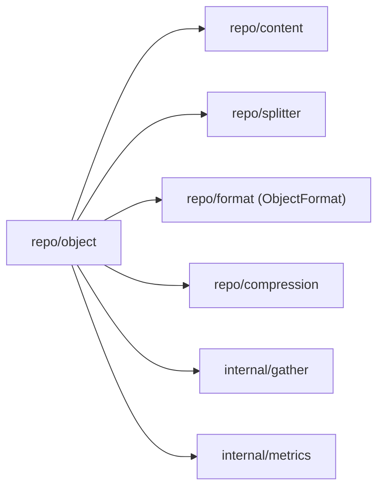

# Package: `repo/object` – Object Manager

## Purpose

`repo/object` builds **variable-length, arbitrarily large objects** on top of the fixed-size content layer. A single object (e.g. a large file) is transparently split into multiple content chunks and reassembled on read.

## Object IDs

```go
// objectid.go
type ID struct { ... }
```

An `ID` is a string-serializable identifier that can reference:

- A single content: `contentID` (e.g. `abc123...`)
- An indirect object (index of chunk IDs): `Icontentid` prefix
- A concatenation: two IDs joined with `,`

Indirect objects allow files larger than one pack blob to be represented as a single logical ID, with the actual chunk list stored in a content whose ID is prefixed with `I`.

## Core Types

### `Manager`

```go
type Manager struct {
    Format             format.ObjectFormat
    contentMgr         contentManager
    newDefaultSplitter splitter.Factory
    writerPool         sync.Pool
}
```

`Manager` is constructed from a `contentManager` and a `splitter.Factory`. It is stateless between writes (writers come from a pool).

### `Writer` (interface)

```go
type Writer interface {
    io.WriteCloser
    Checkpoint() (ID, error)
    Result() (ID, error)
}
```

### `Reader` (interface)

```go
type Reader interface {
    io.Reader
    io.Seeker
    io.Closer
    Length() int64
}
```

## Writing an Object



`WriterOptions` allow callers to:
- Override the splitter algorithm (`Splitter` field)
- Set a description (used in logs)
- Request a specific compression codec

## Reading an Object

```go
func (om *Manager) Open(ctx, id ID) (Reader, error)
```

1. If `id` has `I` prefix → read the indirect content to get the list of chunk IDs.
2. For each chunk ID, call `content.GetContent` and concatenate.
3. Seekable via an in-memory chunk offset table.



## Prefetch

`PrefetchObjects` accepts a list of object IDs, resolves indirect IDs, and issues `PrefetchContents` to the content layer so that the cache warms up before sequential reads.

## Dependencies


