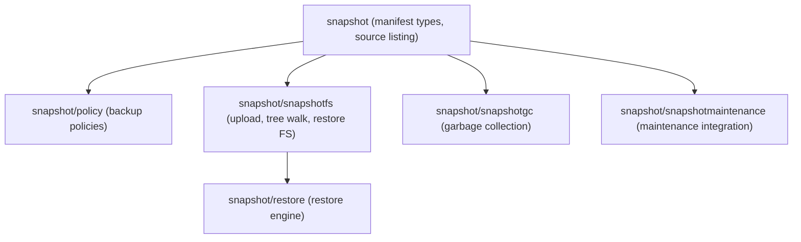
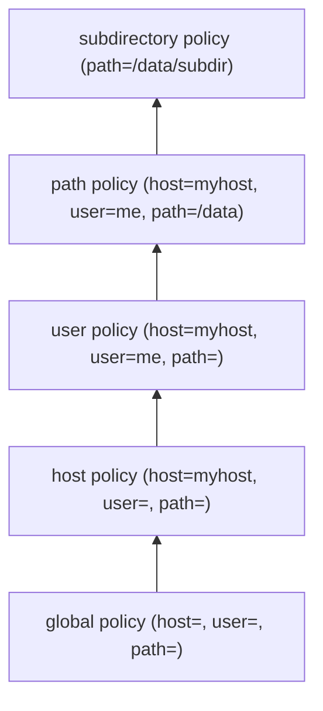
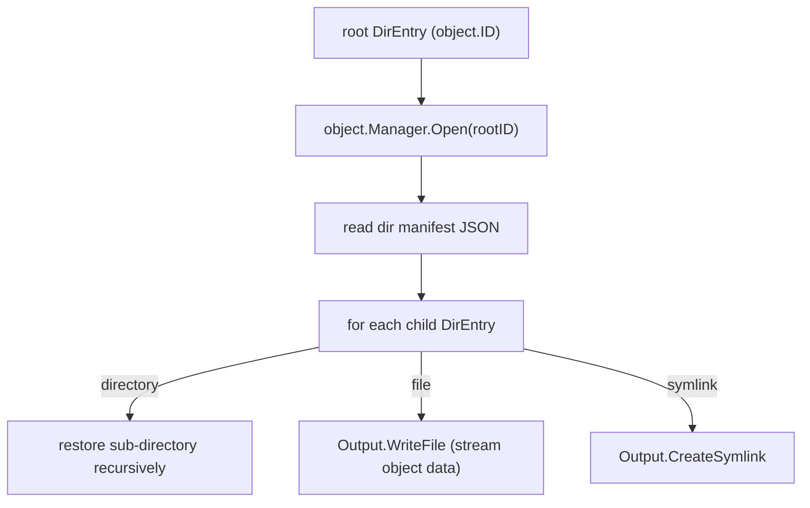

# Package: `snapshot` and Sub-packages

## Overview

The `snapshot` package tree implements the **user-facing backup and restore logic** on top of the repository primitives.



---

## `snapshot` – Core Package

### Purpose

Defines the **data model** for snapshots and provides functions to list/load/save snapshot manifests.

### Key Types

#### `Manifest`

```go
type Manifest struct {
    Source       SourceInfo
    Description  string
    StartTime    fs.UTCTimestamp
    EndTime      fs.UTCTimestamp
    Stats        Stats
    IncompleteReason string
    RootEntry    *DirEntry       // root directory entry with object ID
    Tags         map[string]string
}
```

A `Manifest` is the top-level snapshot record. `RootEntry` contains the object ID of the root directory.

#### `SourceInfo`

```go
type SourceInfo struct {
    Host     string
    UserName string
    Path     string
}
```

Uniquely identifies a backup source (machine + user + path).

#### `DirEntry`

```go
type DirEntry struct {
    Name        string
    Type        EntryType
    ModTime     fs.UTCTimestamp
    Size        int64
    Mode        os.FileMode
    UserID      uint32
    GroupID     uint32
    ObjectID    object.ID
    DirSummary  *DirectorySummary
}
```

### Functions

| Function | Description |
|---|---|
| `ListSources` | Returns all unique `SourceInfo` across all snapshot manifests |
| `ListSnapshots` | Returns all snapshot manifests for a given source |
| `LoadSnapshot` | Loads a single snapshot manifest by ID |
| `SaveSnapshot` | Writes a snapshot manifest to the repository |
| `FindSnapshotByRootObjectID` | Locates snapshots whose root matches a given object ID |

---

## `snapshot/policy` – Backup Policies

### Purpose

Manages **hierarchical backup policies** that control what to back up, how to compress it, how long to retain snapshots, and when to run.

### Policy Structure

```go
type Policy struct {
    RetentionPolicy     RetentionPolicy
    FilesPolicy         FilesPolicy
    ErrorHandlingPolicy ErrorHandlingPolicy
    SchedulingPolicy    SchedulingPolicy
    CompressionPolicy   CompressionPolicy
    SplitterPolicy      SplitterPolicy
    Actions             ActionsPolicy
    OSSnapshotPolicy    OSSnapshotPolicy
    LoggingPolicy       LoggingPolicy
    UploadPolicy        UploadPolicy
    NoParent            bool
}
```

### Policy Inheritance

Policies are resolved via a **policy tree** that inherits from parent paths and the global default:



`policy_tree.go` builds a `Tree` that merges policies from most-specific to least-specific, with child policies overriding parent fields.

### Sub-policies

| Sub-policy | Key Fields |
|---|---|
| `RetentionPolicy` | `KeepLatest`, `KeepHourly`, `KeepDaily`, `KeepWeekly`, `KeepMonthly`, `KeepAnnual` |
| `FilesPolicy` | `Ignore` (glob patterns), `IgnoreRules`, `MaxFileSize`, `OneFileSystem`, `IgnoreCacheDirs` |
| `CompressionPolicy` | `CompressorName`, `OnlyCompress` (extensions), `NeverCompress` |
| `SchedulingPolicy` | `IntervalSeconds`, `TimesOfDay`, `Cron`, `RunMissed`, `Manual` |
| `ActionsPolicy` | `BeforeFolder`, `AfterFolder`, `BeforeSnapshot`, `AfterSnapshot` (shell hooks) |
| `RetentionPolicy` | snapshot expiration rules |
| `OSSnapshotPolicy` | use OS-level snapshots (VSS on Windows, APFS on macOS) |

### Retention / Expiration

`expire.go` implements time-based snapshot expiration. Given a list of `Manifest` entries and the effective `RetentionPolicy`, it marks which manifests should be deleted to satisfy the keep counts.

### Policy Manager

`PolicyManager` reads and writes `Policy` objects through the manifest manager using the `"type"="policy"` label.

---

## `snapshot/snapshotfs` – Upload Engine

### Purpose

Implements the **file system traversal and upload** logic that creates a snapshot.

### `Uploader`

```go
type Uploader struct {
    repo            repo.RepositoryWriter
    Progress        UploadProgress
    CheckpointInterval time.Duration
    // concurrency controls, cancel, ...
}
```

`Upload(ctx, dir, policyTree, sourceInfo, previousManifests)` is the main entry point. It:

1. Traverses the directory tree using `fs.Entry` / `fs.Directory`.
2. Applies `ignorefs` rules from the effective policy at each directory.
3. Compares entries against previous snapshot manifests to detect unchanged files (by size + modification time + inode).
4. Writes new/changed file content through `repo/object.Writer`.
5. Builds directory manifests (`DirManifestBuilder`) with entries and summaries.
6. Periodically checkpoints by flushing partial manifests.
7. Returns the root `object.ID` and an `IncompleteReason` if interrupted.

### Upload Concurrency

`workshare` provides a work-sharing goroutine pool. Files within a directory are uploaded concurrently; the degree of parallelism is bounded by `MaxUploadParallelism`.

### Estimation (`estimate.go`)

`Estimate` does a dry-run traversal (without writing) and returns `ScanStats` (file count, total bytes) to give the user an upload size estimate before starting.

### Snapshot Tree Walker (`snapshot_tree_walker.go`)

`TreeWalker` traverses a snapshot object tree (starting from a root directory object ID) and invokes a callback for each `DirEntry`. Used by `snapshotgc` and verification.

### Snapshot Verifier (`snapshot_verifier.go`)

`Verifier` checks that all object IDs referenced in a snapshot are readable and have correct hashes.

---

## `snapshot/restore` – Restore Engine

### Purpose

Restores snapshot data to a local filesystem, tar archive, or zip archive.

### `Output` Interface

```go
type Output interface {
    BeginDirectory(ctx, relativePath string, e fs.Directory) error
    FinishDirectory(ctx, relativePath string, e fs.Directory) error
    WriteFile(ctx, relativePath string, f fs.File, safety SafetyParameters) error
    CreateSymlink(ctx, relativePath string, e fs.Symlink) error
    // ...
}
```

Implementations:
- `LocalFSOutput` – writes to a local directory with optional atomic replace and preservation of file attributes.
- `TarOutput` – streams to a tar archive.
- `ZipOutput` – streams to a zip archive.
- `ShallowFSOutput` – restores only directory structure with placeholder files.

### Restore Flow



`restore.go` provides `RestoreEntryFromReader` which dispatches based on `DirEntry.Type`.

---

## `snapshot/snapshotgc` – Garbage Collection

### Purpose

Identifies and deletes **unreferenced objects** (content IDs not reachable from any live snapshot manifest).

### Algorithm

1. List all content IDs in the repository (`IterateContents`).
2. Walk all live snapshot object trees (via `TreeWalker`).
3. Collect all object IDs reachable from live snapshots.
4. Mark content IDs not in the reachable set as candidates for deletion.
5. Delete candidate content (subject to safety margins).

GC is typically invoked during repository maintenance (`snapshotmaintenance`).

---

## `snapshot/snapshotmaintenance` – Maintenance Integration

### Purpose

Ties snapshot-level GC into the repository maintenance schedule. `snapshotmaintenance.Run` is called by `repo/maintenance` and orchestrates:

1. Running full or quick maintenance mode.
2. Invoking `snapshotgc` to collect unreachable objects.
3. Calling `repo/maintenance` blob GC and index compaction.
